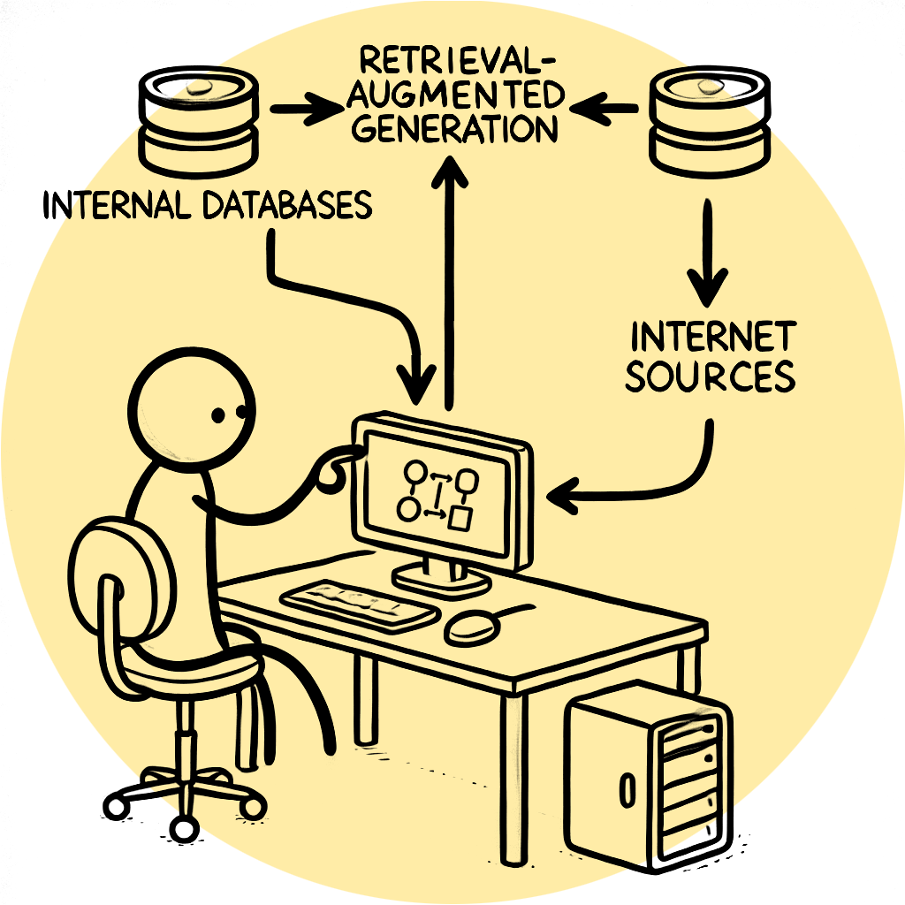

# So How does Retrieval Augmented Generation Work?

RAG, or Retrieval Augmented Generation, can be understood most simply as providing relevant, up-to-date information alongside a question or query to get an accurate answer or action back from a large language model.

Why is this important? LLMs are incredibly capable and knowledgeable systems already, but they do not have access to up to date, domain specific, or proprietary information. Creating RAG based systems can build on top of LLMs intrinsic knowledge by providing the right context at the right time to enrich and improve responses. This often leads to more accurate and "correct" responses when building systems for niche or esoteric data.

In this notebook we'll cover an intuitive approach towards understanding how RAG systems work, for the curious yet daunted reader.

*Note: Some IFrame's and Graphs do not render on GitHub*
